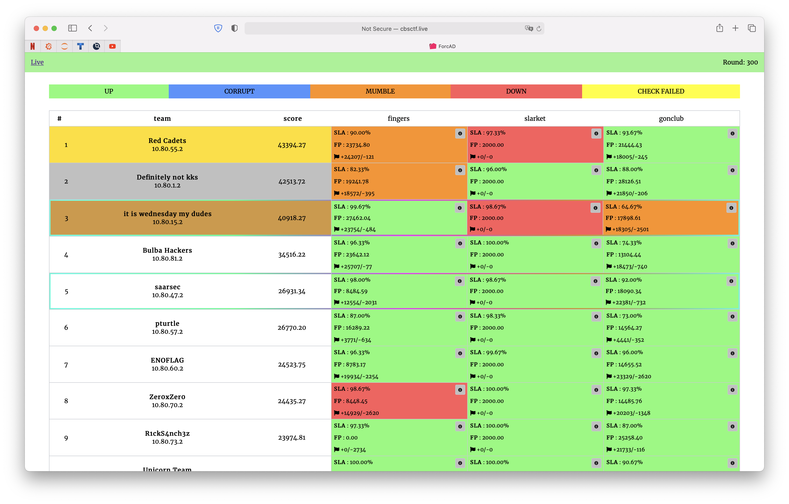

# Attack-Defence training by C4T BuT S4D
Sources of services, checkers and sploits from 27th December 2020 training (AKA Gachi CTF).

## Results

[Full scoreboard](scoreboard/full.png)

## Services

| Service | Lang | Checker | Sploits | Author |
|--------|------|-------|---------|-------|
| **[fingers](services/fingers/)** | Kumir | [Checker](checkers/fingers/) | [Sploits](sploits/fingers/) | [@revervand](https://github.com/revervand) |
| **[slarket](services/slarket/)** | YoptaScript | [Checker](checkers/slarket/) | [Sploits](sploits/slarket/) | [@xmikasax](https://github.com/xmikasax) |
| **[gonclub](services/gonclub/)** | Gonec | [Checker](checkers/gonclub/) | [Sploits](sploits/gonclub/) | [@jnovikov](https://github.com/jnovikov) |

## Infrastructure

- DevOps: [@pomo-mondreganto](https://github.com/pomo-mondreganto).
- Checksystem: [ForcAD](https://github.com/pomo-mondreganto/ForcAD)
